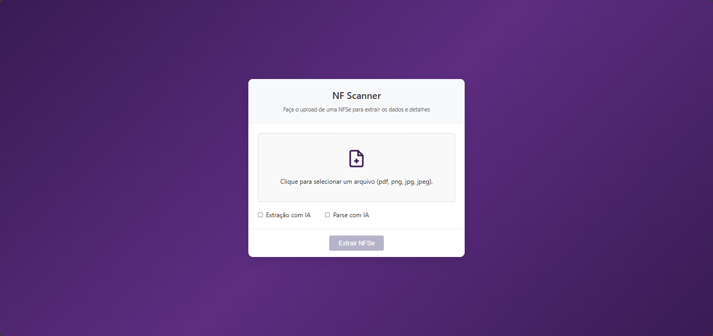
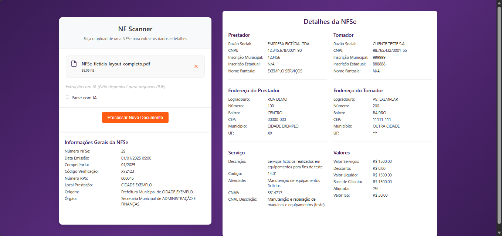

# NF Scanner Web

Uma aplicação web para extração e processamento de dados de Notas Fiscais de Serviço Eletrônicas (NFSe).






## Instalação

Siga os passos abaixo para instalar e configurar o projeto:

1. Clone o repositório:
   ```bash
   git clone https://github.com/nf-scanner/nf-scanner-web.git
   cd nf-scanner-web
   ```

2. Instale as dependências:
   ```bash
   npm install
   ```

## Execução do Projeto

Para iniciar o servidor de desenvolvimento:

```bash
ng serve -o
```

A aplicação irá abrir automaticamente no navegador padrão, caso não abra, acesse `http://localhost:4200`. A aplicação será recarregada automaticamente quando alterações no código forem realizadas.

## Design

O design foi inspirado na interface do [WeTransfer](https://wetransfer.com/), uma aplicação de transferência de arquivos.

A aplicação utiliza o seguinte esquema de cores:

- **Primária:** #391b54 (roxo escuro)
- **Secundária:** #FFFFFF (branco)
- **Destaque:** #ff5c13 (laranja)
